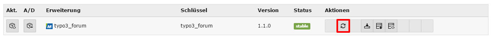
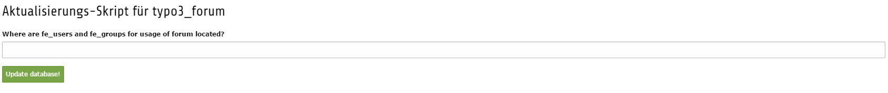
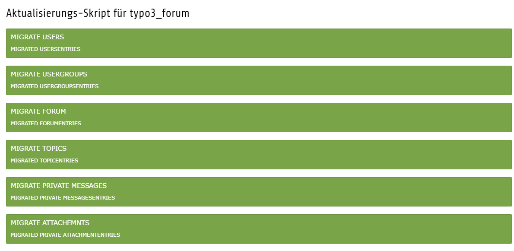

.. ==================================================
.. FOR YOUR INFORMATION
.. --------------------------------------------------
.. -*- coding: utf-8 -*- with BOM.

.. include:: ../Includes.txt

.. _migrationfrommmforum:

Migration from mm_forum Extension
=======================

.. _migrationfrommmforum:

Migrating extension mm_forum to typo3_forum
---------------------
Many users who are using the old extension mm_forum were not able to use the updated extension typo3_forum because there was no way to migrate old forum data to the new extension. The new version 1.1.0 now enables the possibility to migrate old data.
Please note: all mm_forum database tables must be available in the database. Please do not use ‘database analyser’ which will delete old database tables.
Before you start migrating mm_forum to typo3_forum you have to configure the new extension typo3_forum completely. Afterwards you can start the migration.
Please go the extension manager in your TYPO3 backend and search for 'typo3_forum'. You will find a new button for the migration.

Press the button. Then you will be asked for the sysfolder’s PID where your users and usergroups are stored. Enter the sysfolder’s PID and push the 'Update database!' button.

The migration is started and all the old data will be copied to the database tables for typo3_forum. Depending on the size of your installation the process might need some time.

After the migration is done you will receive a confirmation that tells you which data has been migrated. Please note: You can run the migration process as often as you like.

The following data records will be migrated: Forums, Topics, Posts, Users, Usergroups, Private Messages and Attachments (the files have to be uploaded separately).